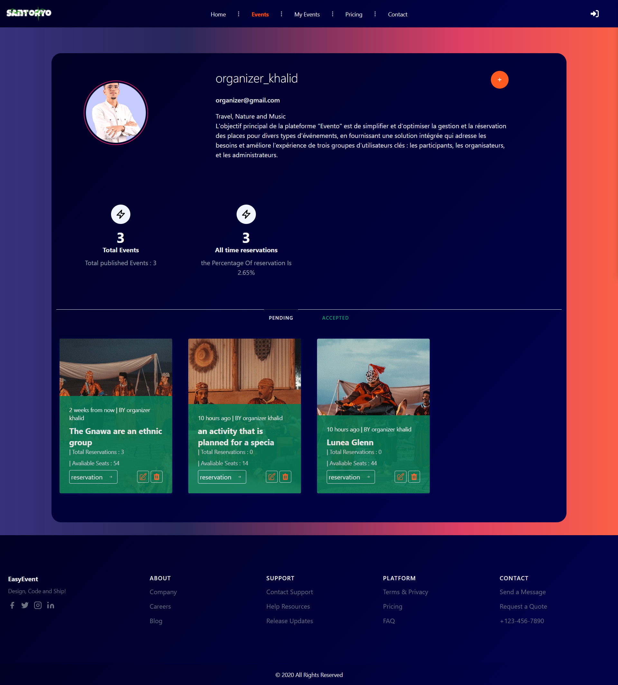
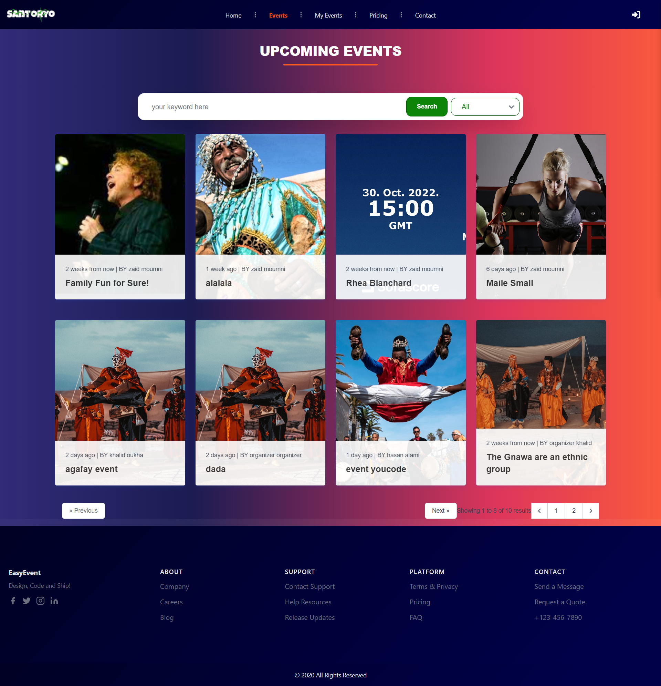

# Evento Platform Readme

Welcome to the "Evento" platform! This readme file provides an overview of the platform, its features, and the technologies used in its development.

# Introduction

The "Evento" platform is a revolutionary solution designed to simplify event management and reservations. It offers a user-friendly interface for both event organizers and participants, making it easy to plan, discover, and join various events.

# Features
## Front-Office
 * User-Friendly Interface: The platform's frontend ensures accessibility for everyone. Users can effortlessly browse through events, filter them by category, and search for specific ones.
* Easy Booking: Booking a spot for an event is just a click away, ensuring a smooth experience for participants.
Back-Office
## Admin Tools: 
* The Back-Office provides administrators with the necessary tools to manage the platform efficiently. 
* They can check event details, manage user accounts, and ensure smooth operations.
## Technology Used
* Planning: Lucidchart and Jira were used for project planning and management.
* Backend Development: The backend of the platform was built using the Laravel framework and MySQL database.
* Frontend Development: HTML & CSS, Tailwind CSS, and JavaScript were used to craft the frontend interface.

# Installation
To run the "Evento" platform locally, follow these steps:

* Clone the repository from [GitHub Repo URL].
* Install dependencies using npm install or yarn install.
* Set up the Laravel environment and configure the database.
* Run the migration and seed the database with sample data.
* Start the development server using php artisan serve or your preferred method.
# Evento Platform Readme

Welcome to the "Evento" platform! This readme file provides an overview of the platform, its features, and the technologies used in its development.

# Evento Platform Readme

Welcome to the "Evento" platform! This readme file provides an overview of the platform, its features, and the technologies used in its development.

## Screenshots

*Front-Office Interface*

*Front-Office Single Page*

*Front-Office Profile*

*Front-Office Events*

*Back-Office Interface*
